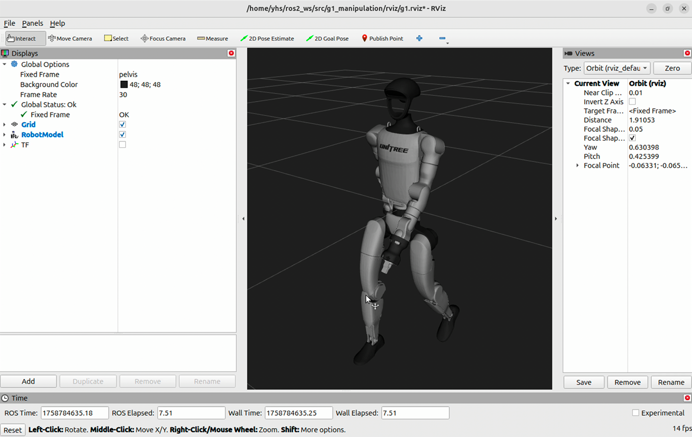

# Humanoid Walking Motion Demo

This repository provides a simple ROS 2 demo for visualizing a humanoid robot model in RViz2 and running a walking motion node.



## Environment

- Ubuntu
- ROS 2
- RViz2
- `robot_state_publisher`

## How to Run

Run the following commands in separate terminals.

---

## 1. Launch RViz2

Start RViz2 with the provided configuration file.

```bash
ros2 run rviz2 rviz2 -d ~/ros2_ws/src/g1_manipulation/rviz/g1.rviz
```

---

## 2. Launch Robot State Publisher

Run `robot_state_publisher` with the robot URDF file.

```bash
ros2 run robot_state_publisher robot_state_publisher \
  --ros-args \
  -p robot_description:="$(cat ~/ros2_ws/src/g1_manipulation/urdf/g1.urdf)"
```

---

## 3. Run the Walking Motion Node

Run the walking motion node from the `g1_manipulation` package.

```bash
ros2 run g1_manipulation walk.py
```

If the node starts correctly, you should see log messages similar to the following:

```text
Joint state publisher node started.
Published smooth joint state - Wave position: 0.000
Published smooth joint state - Wave position: 0.031
Published smooth joint state - Wave position: 0.063
Published smooth joint state - Wave position: 0.094
```

---

## Quick Command Summary

```bash
# Terminal 1
ros2 run rviz2 rviz2 -d ~/ros2_ws/src/g1_manipulation/rviz/g1.rviz

# Terminal 2
ros2 run robot_state_publisher robot_state_publisher \
  --ros-args \
  -p robot_description:="$(cat ~/ros2_ws/src/g1_manipulation/urdf/g1.urdf)"

# Terminal 3
ros2 run g1_manipulation walk.py
```

## Result

After running the commands above, the humanoid robot model should appear in RViz2. The robot will move according to the joint states published by `walk.py`, allowing you to observe the walking motion demo.
